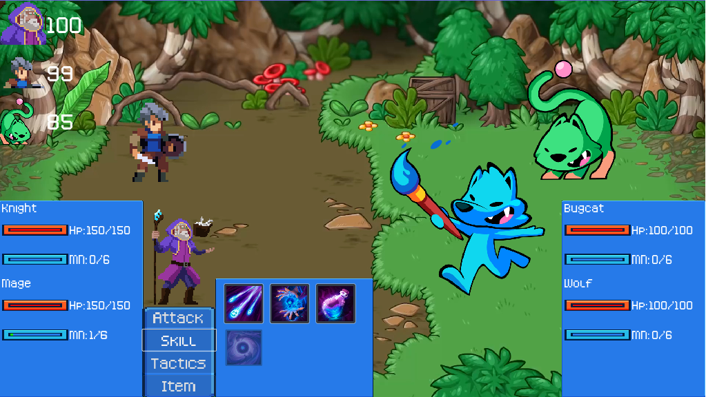

# Godot 4 RPG turn base game from Open RPG

**You need to use Godot 4.3 to open the project!** You can find Godot 4.3 on the [Godot website](https://godotengine.org/).
## Project Goal

The goal of this project is to learn, provide the gamedev community with a demo that shows one solid way to create and structure the code for a 2D RPG in Godot 4. You can reuse the code in your own projects, and also learn from the project's codebase.

## Mission
- Turn-based games.
- A combat system.
- An inventory system.
- Character progression.
- Maps with transitions, dialogues, grid-based movement, and more.
- User interface with multiple menus.

And more! Do you want to contribute and improve your programming skills with Godot? Check out the open issues, suggest improvements and report bugs by opening new ones, and be sure to check the contributing guidelines below.

## Install and run in development
1. Clone the Repository: Open a terminal or command prompt and run the following command to clone the repository to your local machine:
2. Open the Project in Godot: 
    - Click on Import in the Godot project manager.
    - Navigate to the folder where you cloned the repository, select the project.godot file, and click Open.
    - Once imported, the project will appear in the project manager. Select it and click Edit to open.
3. Run the Project
In the Godot editor, click the Play button (▶️) in the top-right corner or press F5 to run the game.
Ensure that no errors appear in the output. If there are issues, ensure you followed all prerequisites and check the project files.

## Build
1. Choose Project -> Export.
2. Make sure you installed export template for this version. [Godot_v4.3-rc3_export_templates.tpz](https://github.com/godotengine/godot-builds/releases/download/4.3-rc3/Godot_v4.3-rc3_export_templates.tpz)
3. Choose your platform and configure export settings.
4. Click on the Export Project button.
## Contributing Guidelines

All contributors are welcome.
